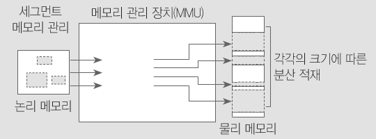

# SW 개발 및 관리
## SW의 특성
- HW와 다른 점
    - SW는 HW에 비해 수정하기 쉬움
    - SW는 시간이 지나도 낡지 않지만, 유지보수에 HW보다 더 많은 비용이 듬
    - SW의 비가시성으로 인해 개발 진행 상태를 알기 어려움
    - SW는 요구사항을 정의하기가 어려움

***

- SW 개발자의 창의성이 개발 기간 및 성능을 결정
- HW와 달리 추가 생산(복제)에 추가비용이 들지 않음 : "수확체증의 법칙"

***

- SW의 특징
    - 인재가 SW의 핵심  
투입인력 수와 성과가 비례하지 않으며, 인력의 질적 역량이 더 중요
    - SW가 기기의 원가 경쟁력을 결정  
잘 개발된 SW는 낮은 성능의 기기로도 원하는 결과물을 보여줌 으로서 원가를 낮출 수 있음
    - SW의 핵심은 재사용  
무형자산인 동시에 복제가 쉬움, 추가 생산을 위한 자원소비가 없음 이런 특징 때문에 Open Source에 대한 관심이 높음

***

## SW공학의 4가지 중요요소
-SW공학 정의 : "SW의 개발, 운용, 유지보수 등의 생명주기가 전반을 체계적이고 서술적이며 정량적으로 다루는 학문"

- 4가지 중요요소
    1. 방법
        - 프로젝트 계획 수립과 추청, 시스템과 SW 분석, 자료구조, 프로그램 구조, 알고리즘, 코딩, 테스팅, 유지관리와 같은 작업으로 구성
        - 종종 특수한 언어 표기법(ex. 객체지향 방법) 또는 그래프 표기법을 도입
        - SW품질에 대한 일련의 평가 기준을 도입
    2. 도구
        - 일을 수행할 때 생산성 혹은 일관성을 목적으로 사용하는 방법들을 자동화나 반자동화 시켜놓은 것을 일컬음
        - SW개발 생명주기 상에 많은 도구가 존재(ex. 요구관리, 모델링, 형상관리, 변경관리 도구)
        - 도구들이 통합되어 하나의 도구가 생성한 정보를 다른 도구가 사용할 수 있을 때, SW개발을 지원하는 시스템으로 설정
    3. 절차
        - 절차는 방법과 도구를 결합, 그것으로 하여금 SW를 합리적이고 적시에 개발할 수 있도록 함
        - 절차는 적용된 방법들, 요구하는 결과물, 품질을 보증하고 변경을 조정하게 돕는 제어들, SW관리자들이 진행을 평가하게 해주는 마일스톤 등의 순서를 정의함
    4. 사람
        - SW공학에서는 많은 것들이(수립,개선,유지,등) 사람과 조직에 의해 움직임으로 사람에 의한 의존성의 상대젹으로 큼
        - 타 공학의 상황보다 훨씬 많은 이슈들이 생김으로 SW개발을 일목요연하게 공학적으로 정리하는 것은 현실적으로 불가능

***

- SW 생명주기
    - 정의
        - 사용자 환경이해에서 운용, 유지/보수까지 모든 과정을 의미
        - 일반적인 소프트웨서 생명 주기는 아래의 활동으로 구성  
        "타당성 검토 -> 개발 계획 -> 요구사항 분석 -> 설계 -> 구현 -> 테스트 -> 운용 -> 유지보수" 
    - 목적
        - 프로젝트 비용 산정, 개발 계획 수립 기본골격 구성
        - 용어의 표준화
        - 프로젝트 관리
    - 프로젝트 생명주기 선정
        - 기업에서 프로젝트의 개발 프로세스를 테일러링 하는데 필요한 활동
        - 시스템 개발의 리스크와 불확실성에 대한 이해를 바탕으로 수행
        - 선택한 모델은 프로젝트에 존재하는 리스크 불확실성을 최소화 할 수 있어야 함
        - 폭포수 모델, 프로토타입 모델, 진화 모델, 증분 모델 등이 대표적인 모델
    - 나선형 모델
        - 포로토타입을 지속적으로 발전시켜 최종 SW 개발까지 이르는 점증적 방법, 위험관리가 중심임
        - 재정적/기술적 위험부담이 큰 대규모 시스템을 구축해 나갈 때 가장 현실적인 접금 방법
        - 성과를 보면서 조금씩 투자하여 위험 부담을 줄일 수 있다
        - 프로젝트 개발 비용 및 일정관리가 중요하며, 위험분석이 가장 중요
        - "계획수립 -> 위험분석 -> 개발/구축 -> 고객평가"
    - Agile 모델
        - 품질의 저하없이 병화를 수용하고 협업을 강조, '제품의 빠른 인도'를 강조
        - 중/소단위 SW에 적합
     
     ***
     
     |나선형 모델|Agile 모델|
     |:---:|:---:|
     |Less Document-oriented|Code-oriented|
     |문서기반 계획 수립 중심|코드기반 프로토타입 중심|
     |위험 부담 최소화|그때그때 빠른 적응|
     |대규모|중/소규모|
     
     

## SW 개발 소개
- SW 개발
    1. 요구사항 분석
        - SW개발에서 가장 어려운 부분은 무엇을 개발할 지 정확히 결정하는 것
        - SW요구분석은 SW개발의 실질적인 첫 단계로 사용자의 요구를 이해하는 단계
        - 전체 개발 과정중 개발 비용을 감소시킬 수 있는 결정적인 단계
        - 초기에 요구사항을 잘 분석하여 정의하고 관리하기 위해 투자한다면, 전체 SW 개발 기간, 비용의 초과와 품질저하를 방지할 수 있음
    2. 설계
        - 요구사항 분석이 개념적인 단계라면, 설계는 물리적 실현의 첫 단계
        - 시스템 설계는 서브 시스템으로 이루어지는 시스템 구조를 결정, 서브 시스템들은 HW,SW 등 구성요소에 할당
        - 설계는 품질에 직접적인 영향을 줌
        - 설계가 제대로 되지 않으면 시스템의 안정감 저하, 안정감 없는 시스템은 유지보수도 어려움
    3. 구현
        - SW 구현단계의 목표 : 설계 명세를 기반으로 요구사항을 만족하도록 프로그래밍 하는 것
        - 프로그램은 상세 설계나 사용자 지침서와 일치하도록 코딩 해야 함
        - 코딩 표준을 정하고, 이를 기반으로 명확한 코드를 짜는 것이 가장 중요한 작업
    4. 테스팅
        - 시스템이 정해진 요구를 만족하는지, 예상과 실제 결과의 차이에 대해 수동/자동화 된 방법을 동원해 검사/평가
        - SW 품질보증을 위한 마지막 단계, 품질 확보를 위해 결함을 찾아내는 작업
        - SW 품질 평가와 품질향상을 위한 수정작업이 포함됨

***

- SW 관리  
    SW 관리 활동은 SW 운영상의 문제점/개선 요청 대응, 개발에서 작성되는 산출물 간의 추적성/무결성/프로젝트 가시성 확보 하며 SW 개발 활동이 체계적으로 진행되게끔 지원한다
    
    1. SW 유지관리
        - 개발 동안에도 후에도 많은 변경이 필요
        - 이런 지속적인 변경을 수용할 수 있도록 개발
        - 고객에게 SW가 인도되어 사용되는 과정에 발생하는 여러 변경사항들에 적응하는 활동, 변화에 대비하는 과정
    2. SW 요구관리
        - 잘못된 선입견으로 HW 설계변경보다 빈번히 발생
        - 프로젝트 관계자들의 요구사항을 추출, 구성/문서화 하고, 변경에 대한 동의를 설정해 관리하는 시스템적인 활동
        - 목적 : 의사소통, 협업, 검증
    3. SW 형상관리
        - SW 개발/유지과정에서 발생하는 산출물(문서,소스코드)에 대한 계획/개발/운용 등을 종합하여 시스템의 형상을 만들고, 이에 대한 변경을 체계적으로 관리/제어하기 위한 활동
        - SW 개발/유지과정에서 변경을 통제하는 절하는 산출물을 관리하고, 고품질의 SW를 얻기 위해 매우 중요
    4. SW 품질관리
        - SW 개발활동이 프로젝트 계획과 일치하고 조직 정책에 적합한지 검증하는 활동
            - SW 품질의 정의 : 요구사항을 만족시킬 수 있는 SW 속성의 정도,  
                명시적/묵시적 요구를 만족시키기 위한 SW 제품이나 서비스의 능력과 관련된 특성 전체로도 정의
        - SW 의 대표적인 품질특성 (종류와 사용목적이 다양해서 보편적/일관적으로 분류하기는 어려움)
            1. 기능성 : 기능구현 완전성/정확성/상호운용성, 보안성, 표준준수성 등
            2. 신뢰성 : 운용 안정성, 장애복구 용이성, 서비스 지속성, 데이터 회복성 등
            3. 사용성 : 기능학습 용이성, 입출력 데이터 이해도, 사용자 인터페이스 조정 가능성/일관성 등
            4. 효율성 : 반응시간, 자원사용율, 처리율 등
            5. 유지보수성 : 문제진단/해결지원, 환경설정변경 가능성, 업데이트 용이성 등
            6. 이식성 : 운영환경 적합성, 선치제거 용이성, 하위 호완성 등
        - 필요에 따라 품질특성 중 적절한 것을 선택해 사용하고 이에 따라 적절한 검증활동(ex. 리뷰, 인스펙션, 테스팅, 시뮬레이션)을 수행해야함

***

# SW 기반기술
## 자료구조

|선형구조|비선형구조|
|:---:|:---:|
|배열, 리스트, 스텍, 큐|트리, 그래프|

- 자료구조의 선택 기준
    1. 자료의 처리시간
    2. 자료의 크기
    3. 자료의 활용빈도
    4. 자료의 갱신정도
    5. 프로그램의 용이성
    
- 자료구조별 활용 예시
    1. 배열 : 리스트의 구현, 다항식의 덧셈, 희소행렬 
    2. 리스트 : 배열의 구현, DBMS 인덱스, 탐색,정렬 
    3. 스텍 : 인터럽트 처리, 재귀 프로그램 순서 제어, 서브루틴 복귀 주소 저장, 후위표기법 연산, 텍스트에디터 Undo기능
    4. 큐 : 운영체제의 작업 스케줄링, 대기행렬 처리, 비동기 데이터 교환(파일I/O, Piped, Sokets), 키보드 버퍼, Spool 운용
    5. 트리 : 탐색/정렬, 문법의 파싱(ex.트라이), 허프만 코드, 결정 트리, 게임이론
    6. 그래프 : 네트워크, 전기회로 분석, 이항관계, 연립 방정식

## 알고리즘
- 알고리즘의 정의 : 주어진 문제를 해결하기 위한 일련의 철;절차를 단계적으로 기술한 것
- 알고리즘의 조건
    1. 입력/출력(Input/Output) : 알고리즘의 수행에 필요한 자료가 0개 이상 입력되고, 수행 후 1개 이상의 결과를 출력해야 한다
    2. 명확성(Definiteness) : 수행할 작업의 내용과 순서를 나타내는 각 처리 단계들은 명확하고 모호하지 않아야 한다
    3. 유한성(Finitness) : 알고리즘은 작업의 수행 후 반드시 종료해야 한다
    4. 유효성(Effectiveness) : 모든 단계의 처리가 명백하게 수행 가능해야 한다

***

- 알고리즘의 분석 조건
    1. 정확성(Correctness) : 알고리즘이 타당한 입력에 대해, 유한시간 내에 올바는 결과를 산출하는가
    2. 작업량 : 알고리즘을 수행하는데 걸리는 수행 횟수, 흐름의 핵심이 되는 중요한 연산들로 작업량을 측정한다
    3. 메모리 사용량 : 알고리즘을 수행하는 동안 사용하는 메모리의 양
    4. 최적성 : "이 알고리즘이 최적이다" 라는 것은 해당 알고리즘을 적용할 시스템의 사용환경에서 그 이상의 적합한 알고리즘이 없다는 것
    5. 단순성/명확성 : 알고리즘의 표현이 이해하기 쉽게 명확히 작성 되었는지를 의미
    
***

- 알고리즘 성능 분석
    1. 공간복잡도 : 알고리즘을 실행하여 완료하기 까지 필요한 총 저장공간, 고정 공간량과 가변 공간량의 합으로 구한다
        - 고정 공간량 : 프로그램, 변수 및 상수와 같이 프로그램의 크기/입출력과 상관 없이 고정적으로 필요한 공간
        - 가변 공간량 : 프로그램의 수행과정에서 경우에 따라 크기가 가변하는 공간
    2. 시간복잡도 : 알고리즘을 실행하여 완료까지 걸리는 시간, 컴파일 시간과 실행시간의 합으로 구한다
        - 컴파일 시간 : 프로그램 특성과 관련이 적은 고정적이 시간, 일단 컴파일이 되면 프로그램의 수정이 일어나지 않는 한 일정히 유지
        - 실행 시간 : 프로그램의 실행시간으로 컴퓨터 성능에 의존함으로 실제 정확한 실행시간보다는 시간복잡도를 구함

*** 

- 정렬(Sort) 알고리즘  
    : 정렬은 정렬 장소에 따라 2종류로 구분
    - 내부 정렬 : 소량의 데이터에 대해 주기억장치에 올려서 정렬하는 방법, 정렬 속도는 빠르나 주기억 장치의 용량에 따라 정렬가능한 데이터의 양이 제한됨
    - 외부 정렬 : 대량의 데이터에 대해 보조기억장치에서 정렬하는 방법, 대량의 데이터를 몇개의 서브파일로 나누어 내부 정렬한 후 보조기억장치에서 정렬된 각 서브파일을 병함하는 방식으로 속도가 느림
    
- 정렬 알고리즘의 종류 (내부정렬)
    - 삽입법 : insertion, shell
    - 교환법 : selection, quick, bubble
    - 선택법 : heap
    - 병합법 : merge
    - 분배법 : counting, radix, bucket

1. insertion sort  
    : 자료의 모든 요소를 앞에서부터 차례대로 이미 정렬된 배열 부분과 비교하여, 자신의 위치를 찾아 삽입함으로써 정렬을 완성
    ```c
    void insertion_sort ( int *data, int n ){
        int i, j, remember;
        for (i = 1; i < n; i++ ){
            remember = data[(j=i)];
            while (--j >= 0 && remember < data[j] ){
                data[j+1] = data[j];
                data[j] = remember;
            }
        }
    }
    ```
    
2. shell sort  
    : 자료를 특정 매개변수 값의 길이를 갖는 부파일(subfile)로 쪼개서, 각 부파일에서 정렬을 수행 후, 매개변수값을 줄이며 이 과정을 반복
    ```c
    // 나중에 update
    ```
3. ~~~~~~~~~~~~~~~~ 나중에 update


- 정렬 알고리즘 분석 (d : 자리수)

|정렬방법|최악|평균|최선|추가메모리|
|:---:|:---:|:---:|:---:|:---:|
|insertion|O(n^2)|O(n^2)|O(n)|X|
|shell|O(nlogn)|O(n^1.5)|O(n)|X|
|selection|O(n^2)|O(n^2)|O(n)|X|
|quick|O(n^2)|O(nlogn)|O(nlogn)|X|
|bubble|O(n^2)|O(n^2)|O(n)|X|
|heap|O(nlogn)|O(nlogn)|O(nlogn)|X|
|merge|O(nlogn)|O(nlogn)|O(nlogn)|O|
|redix|O(dn)|O(dn)|O(dn)|O|


## 탐색  
: 데이터 집합에서 원하는 항목을 효율적으로 찾는 기법, 데이터 정렬 여부에 따라 순차탐색(Linear), 제어탐색(Control)으로 구분 별개로 해싱도 있음.
    
- 탐색의 종류 
    - 순차 탐색 : Linear (데이터 정렬 불필요)
    - 제어 검색 : Binary, Fibonacci, Interpolation, Bolok, BinaryTree (데이터 정렬 필요)
    - 특정 함수이용 : Hashing (데이터 정렬 불필요)
    
1. Linear Search (순차탐색)
    - 데이터 정렬 없이 순서대로 자료를 순회하여 목표를 찾는 방법
    - 프로그램 작성이 용이
    - 파일이 커질수록 탐색 시간이 증가
    - 평균비교횟수 : (N+1)/2, 평균검색시간 : O(N)
    
2. Binary Search
    - 상한, 하한을 설정하고, 그 중간값을 구한 후 값을 비교하며 탐색 대상을 1/2로 줄여나감
    - 최대 : O(logN)

3. Fibonacci Search
    - 피보나치 순열을 이용, 서브파일을 형성해 나가면서 검색하는 방법
    - 이진탐색은 나눗셈을 이용하지만, 피보나치 검색은 덧셈, 뻴셈만을 사용함으로 검색 효율을 늘림
    - 하지만 이진탐색에 비해 불균형한 트리가 형성됨으로 데이터의 분포에 따라 더 느릴수도 있다
    - 최대 : O(logN)
    
4. InterPolation Search
    - 탐색대상이 있을 것으로 예상되는 위치를 선택하여 찾아가는 방법, 이후 그 구간에서 선형 탐색을 실시함
    - 사전, 전화번호부, 인명록의 탐색에서 사용
    - 평균 : O(logN)
    
5. Block Search
    - 전체 데이터를 일정한 개수의 블록으로 구분, 찾기를 윈하는 데이터가 속한 블록을 찾아 블록 내부 구간을 선형 탐색
    - 표율적인 블록의 크기는 √N
    - 평균 : O(logN)
   
6. BinaryTree Search
    - Binary Tree를 이용하는 검색방법
    - 데이터 삽입/삭제/검색 모두 최대 : O(logN)
    
7. Hashing
    - 해시함수를 이용해 데이터가 저장된 주소를 직접 계산하여 찾아내는 방법
    - 삽입/삭제가 빈번한 자료에 적합
    - 평균 : O(1)

***

## 운영체제 (OS : Operating System)  
 : 컴퓨터 하드웨어와 응용프로그램간의 중재자 역할 
 
- OS 구성요소 : ProcessScheduler, MemoryManager, I/O Manager, IPC(InterProcessCommunicationManager), FileSystemManager

- 프로세스(Process)  
정의 : 실행중인 프로그램, PCB(ProcessControlBlock)을 가진 프로그램, 운영체제가 관리하는 실행의 단위 (작업(Job), Task 라고도 불린다)

    - 프로세스의 상태 (프로세스의 생명주기)  
    
      
    
        - 생성 : 프로세스의 생성, 아직 실행 가능하지 않은 상태
        - 준비 : 프로세스가 실행을 위해 CPU를 할당받기를 대기중
        - 실행 : 프로세스가 CPU를 할당받아 실행
        - 종료 : 프로세스의 실행이 끝나고, CPU할당이 종료
        - 대기 : 프로세스가 실행되다가, I/O 등의 이유로 기다리는 상태
        
- PCB(ProcessControlBlock)  
: OS가 프로세스 관리를 위해 필요한 정보를 저장하는 것, 프로세스의 생성/종료마다 고유한 PCB가 생성/삭제 된다  
: PID(ProcessIdentificationNumber), 프로세스 상태, 프로그램 카운터(다음명령어의 주소), 스케줄링 우선순위, 레지스터 정보, 주기억장치 관리정보 등으로 구성
    
- Thread  
: 프로세스 내부의 작업단위, 프로세스 생성과 달리 OS가 부모 프로세스와 공유할 자원을 초기화 할 필요가 없어서 생성/종료의 부하가 적다  
: 쓰레드를 통해 병행성을 촉진하고, HW/OS의 성능,응용 프로그램 처리율을 향상시킨다  
:실행 환경의 공유로 메모리 낭비를 줄이고, 공통적으로 접근 가능한 메모리를 이용해 효율적인 통신을 지원한다


***

- 병행 프로세스(Concurrent Process)  
:병행 프로세스는 두개 이상의 프로세스를 동시에 처리하는 것을 의미, 공유자원에 대한 배타적인 접근이 보장되지 않으면 심각한 오류가 발생 할 수 있다.
    - 오류방지 방법
        - 임계영역(Cretical Section)  
        : 특정 작업시점에 하나의 프로세스에만 공유자원(데이터)를 사용하다록 허용된 영역
        - 상호 배제(Mutual Exclution)  
        : 한 순간에 하나의 프로세스만 공유자원을 변경가능하게 하는 기법, 한 프로세스가 사용하는 동안 다른 프로세스는 기다려야 한다  
        ex) SW적 해결(Dekker,Peterson Algorithm), HW적 해결(인터럽트 비활성화, Test-and-Set명령어, Compare-and-Swap명령어)  
        - 세마포어(Semaphore)  
        : 데이터의 정확성/일관성을 보장하기위해 Dijkstra에 의해 고안된 상호배제를 이루는 방법, P(Wait)/V(Signal) 두가지 연산에 의해서만 액세스 될 수 있게 통제하는 방법, 운영체제에서 지원
        - 모니터(Monitor)  
        : 병행다중 프로그래밍에서 상호배제를 구현하기 위한 특수한 프로그래밍 기법, 공유자원을 정당하게 할당하기 윟나 병행성 구조
  
*** 

- 교착상태 (Deadlock)  
: 둘 이상의 프로세스가 서로 다른 프로세스가 차지하는 자원을 요구하고 이 자원이 영원히 할당되지 않아 결국 해당 프로세스가 무한히 기다리는 현상

    - 교착상태의 발생조건
        - 상호배제 (Mutual Exclusion)  
        : 한번에 하나의 프로세스만이 공유자원을 사용가능한 상태
        - 점유 및 대기(Hold & Wait)  
        : 프로세스들이 현재의 자원을 점유하면서 자른 가원을 요구하는 상태
        - 비선점 (Non-Preemption)  
        : 각 프로세스에 할당된 자원은 사용이 완료될 때까지 강제로 해제할 수 없는 상태
        - 환형대기 (Circuler Wait)  
        : 서로다른 프로세스간의 자원요구가 연속적으로 반복되는 상태

    - 교착상태의 해결방안
        - 예방 (Prevention)  
        : 교착상태의 발생조건을 제거하여 사전에 미리 예방
        - 회피 (Avoidance)  
        : 교착상태의 발생조건을 제거하지 않고, 적절히 피해나가는 방법
        - 발견 (Detection)  
        : 교착상태의 발생을 허용하고, 발생시 원인을 찾아 해결하는 방법
        - 회복 (Recovery)  
        : 교착상태에 빠진 프로세스를 재시작하거나 원래 상태로 되돌림으로써 교착상태를 해결하는 방법
        
***

- 스케줄링 (Scheduling)  
: 다중 프로그래밍을 지원하는 운영체제에서 CPU활용의 극대화를 위해 프로세스를 효율적으로 CPU에 할당하는 것
    - 스케줄링의 목적 : 프로세스 공정성, 단위시간당 처리량의 극대화, 반응시간의 최소화, 수행시간 예측, 시스템 과부하 방지, 균형있는 자원활용, 프로세스 수행의 무한정 연기 방지, 우선순위 제도 실시 등
    - 스케줄링 알고리즘의 분류
        - 선점형 스케줄링 (Preemption Scheduling)  
        : 한 프로세스가 CPU(자원)를 점유하고 있을 때 다른 프로세스가 CPU(자원)을 빼앗을 수 있는 방식
        - 비 선점형 스케줄링 (Non-Preemption Scheduling)  
        : 일단 한 프로세스에 자원이 할당되면 작업이 완료되기 전까지는 CPU(자원)를 다른 프로세스에 할당 할 수 없는 방식
    
    - 스케줄링 알고리즘의 종류 (비선점)
        - FIFO (First-In-First-Out)  
        : CPU(자원)요청 순서대로 CPU에 할당(FCFS: First-Come-First-Served)  
        : 간단하고 공정함, 반응속도 예측이 쉬움, 대화형에는 부적합
        - 우선순위 (Priority)  
        : 각 프로세스에 우선순위를 부여, 우선순위가 높은 프로세스에 CPU를 할당  
        : 고정적/가변적/구입된 우선순위로 구분
        - SJF (Shortest Job First)  
        : 예상 작업시간이 가장 짧은 프로세스에 먼저 CPU를 할당  
        : 수행시간이 짧은 작업에 유리
        - HRN (Hightest Response-ratio Next)  
        : SJF에서 큰 작업이 시간이 많이 걸리는 점을 보완  
        : 우선순위 = (대기시간 + 수행시간)/수행시간
        - 마감시간 (Deadline)  
        : 주어진 제한시간 내에 프로세스가 반드시 완료되도록 하는 방식  
        : 마감시간을 계산해야 함으로 막대한 오버헤드와 복잡성이 발생 
    
    - 스케줄링 알고리즘의 종류 (선점)  
        - R-R (Round Robin)  
        : FIFO 처럼 먼저 들어온 프로세스가 실행되나, 각 프로세스는 정해진 시간동안만 CPU를 사용하는 방식 (선점형 FIFO)
        : 시분할 처리(TSS)에 가장 적합한 방식
        : 할당시간이 크면 FIFO와 같고, 적으면 문맥교환이 자주 일어남
        - SRT (Shortest Remaining Time)  
        : 수행 도궁에 남은 작업시간 추정치가 가장 작은 프로세스에 CPU를 할당하는 방식 (선점형 SJF)  
        : 작업처리는 SJF와 같으나 이론적으로 가장 작은 대기시간이 소요됨
        - MLQ (Multi-Level Queue)  
        : 서로 다른 작업을 각각의 큐에서 타임슬라이스에 의해 처리
        : 각각의 큐는 독자적인 스케줄링 알고리즘을 사용
        - MFQ (Multi-Level Feedback Queue)  
        : 하나의 준비상태 큐를 통하여 여러개의 피드백 큐에 걸쳐 처리  
        : CPU와 I/O장치의 효율을 높일 수 있음
    
***

- 가상기억장치 (Virtual Memory)  
: 논리적인 방법으로 대용량의 보조기억장치를 주기억장치처럼 이용, 이를 통해 적은 주기억장치 용량을 대용량처럼 이용하게 한다  
: 가상기억장치에 저장된 프로그램을 실행하려면 가상기억장치의 주소를 주기억장치의 주소로 매핑하는 작업이 필요하다

- 가상기억장치의 구현 기법  
: 가상기억장치는 프로세스에서 참조하는 가상주소(Virtual Address)와 주기억장치의 실제 사용가능한 영역을 가리키는 실제주소(Physiacl Address)가 있다
: 시스템은 프로세스가 가상주소에 접근할 때마다 메모리 관리장치(MMU: MemoryManagement Unit)을 통해 이를 실제 주소로 빠르게 변환해야 한다
: 블록의 구성에 따라 아래 두가지 기법으로 나뉘며, 두 방법을 결합해 사용하기도 한다
    - 페이징 기법  
    : 주기억장치를 '프레임'이라 불리는 동일한 크기로 분할, 가상기억장치에 보관되어 있는 처리할 작업도 '페이지'라 불리는 동일한 크기로 분할하여 이를 주기억장치의 프레임에 적재시켜 실행하는 기법  
    
    - 세그멘테이션 기법  
    : 가상기억장치의 처리해야 할 작업을 다양한 크기의 세그먼트로 분할, 주기억장치에 적재시켜 실행하는 기법, 메모리가 절약됨  
    
